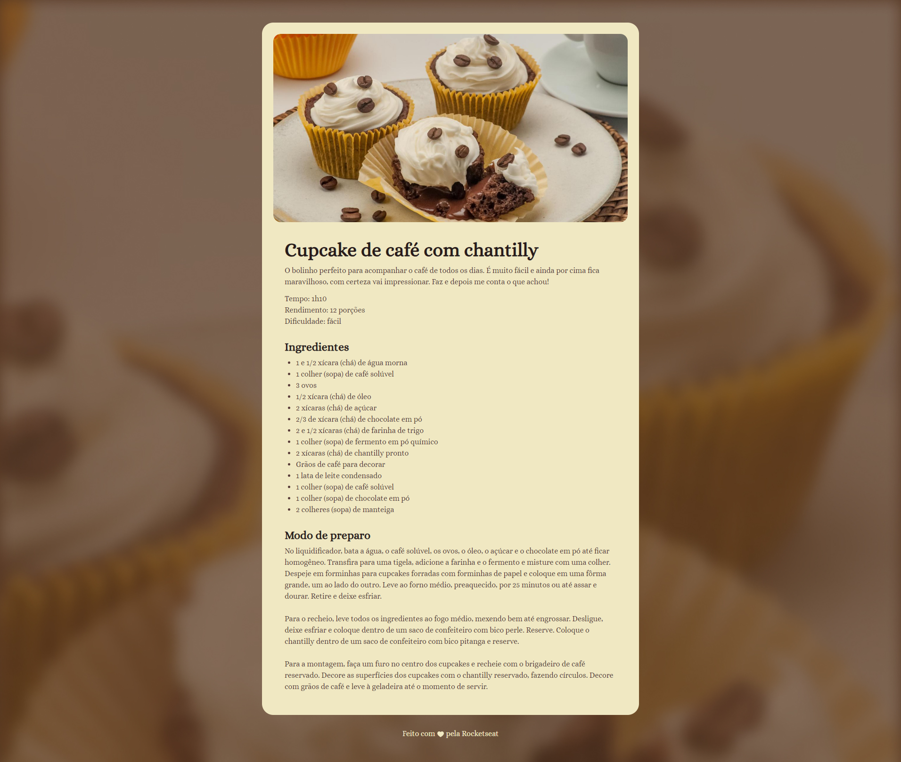

# Página de Receita - Cupcake de Café com Chantilly
Este projeto foi desenvolvido durante o curso fullstack da Rocketseat, com o objetivo de praticar os fundamentos de **HTML5** e **CSS3**. A proposta foi criar uma página simples de receita culinária.

## 🚀 Tecnologias utilizadas

- HTML
- CSS
- Git e Github
- Figma

## 🧾 Funcionalidades
- ✅ Estruturação semântica da página
- ✅ Estilização com CSS para melhorar a apresentação visual
- ✅ Organização clara dos ingredientes e modo de preparo
- ✅ Boa hierarquia visual com títulos, listas e espaçamento adequado

## 📸 Preview

Feito com 💜 por Erika
